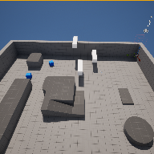
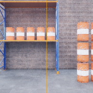
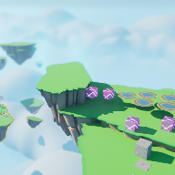
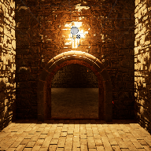

# LearningUnreal5
 A repo containing projects I made while working through a Udemy course to learn Unreal Engine 5. (v5.3.2)
 
## Projects

### IntroProject

The third person template with added blocks for platforming. This was to introduce basic Unreal tools.

### WarehouseWreckage

A simple project where the player shoots physics-enabled spheres at a set of warehouse-themed physics-enabled objects to knock them down. The player has a limited number of shots and the level resets when the ammo is depleted. This project was programmed using the Blueprint system.

### ObstacleAssault

A third person platforming game on one small level with code written in C++.

### CryptRaider

A first person game where the player must pick up a statue to bring to a specific area to open a secret wall.

**NOTE:** CryptRaider/Content/MedievalDungeon is a __REQUIRED__ content pack which was not included in this repo, the content pack can be downloaded from [here](https://www.unrealengine.com/marketplace/en-US/product/a5b6a73fea5340bda9b8ac33d877c9e2)